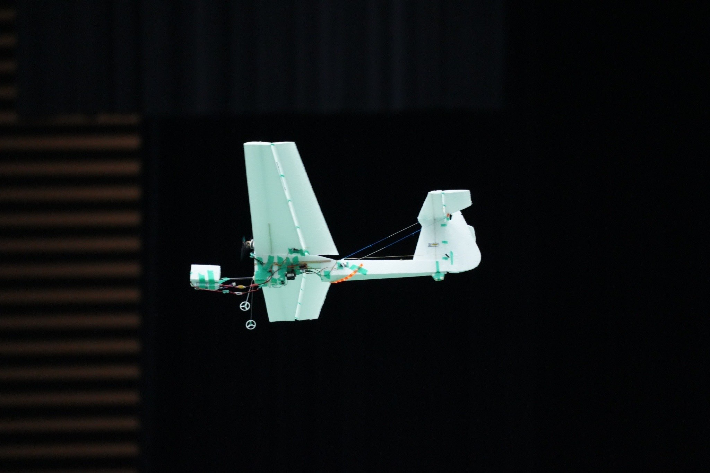

# NOKOLAT2024 Indoor-Flight Contest ksenos's ROS2 nodes

## 競技紹介

屋内でモーターで飛ぶ飛行機で競技を行う。飛行エリアの広さは 30x42x10m、機体重量は 200~250g、機体の横幅 1m~1.5m、 飛行速度は 0~10m/s、巡航時の消費電力は 10~20W のようなスケール感である。NOKOLAT では発泡スチロールにバルサ材で補強を行った構造をよく使用している。

競技内容は一般、自動操縦、マルチコプターによって異なる。出場した自操部門では以下の競技に挑戦できる。2.~4.については手動操作で機体を操作して適当な姿勢にしてから自動モードに移行できる。

1. 手動操作で離陸後目標地点に物資を投下
1. 一定の高度で旋回を続けて 3 周
1. 一定の高度で 8 の字状に左右旋回
1. 低い高度で 2 回旋回後、上昇しさらに 2 周
1. 自動で離陸後目標地点に物資を投下、着陸エリアに着地

ミッション内容と機体の制約から機体に搭載するセンサーは 9 軸 IMU+(ToF or 気圧計)の構成が多い。手動操作向けに S.BUS 受信機を備えている。自動離着陸の達成のために位置推定用としてカメラを搭載する構成も存在する。

## 概念設計

開発開始が 6 月中旬、大会が 9 月中旬と開発期間は 3 か月間だった。非常に短期での開発となるためできるだけ楽をしたいと考えた。テレメトリーをオンラインで取得するために地上に設置した PC と機体で通信を行うまた今まで使用していた ROS Noetic が EOL になるため、ROS2 に挑戦したかった。

これらの条件から ROS2 Humble + micro-ros Arduino を用いて開発することを決めた。

## 処理内容

## お気持ち

## カスタムメッセージとマイコンとの通信

## 各ノードの説明

## 各 launch file の説明
