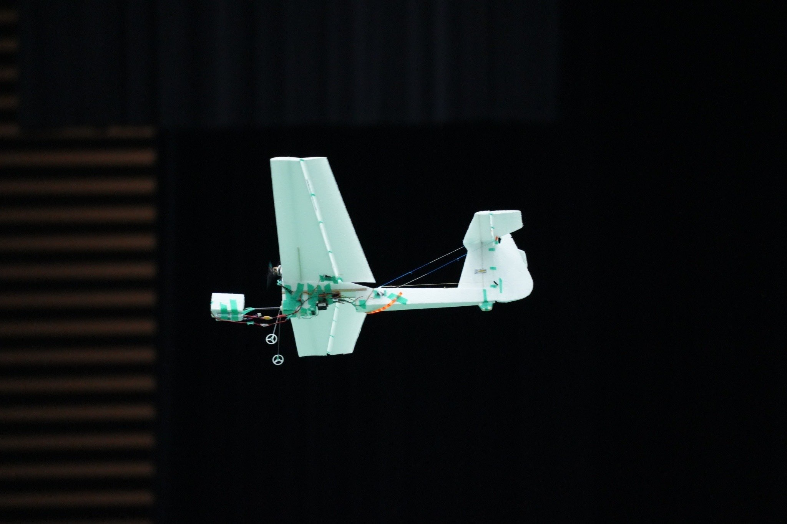

# NOKOLAT2024 Indoor-Flight Contest team ksenos

## 競技紹介

屋内でモーターで飛ぶ飛行機で競技を行う。飛行エリアの広さは 30x42x10m、機体重量は 200~250g、機体の横幅 1m~1.5m、 飛行速度は 0~10m/s、巡航時の消費電力は 10~20W のようなスケール感である。NOKOLAT では発泡スチロールにバルサ材で補強を行った構造をよく使用している。

競技内容は一般、自動操縦、マルチコプターによって異なる。出場した自操部門では以下の競技に挑戦できる。2.~4.については手動操作で機体を操作して適当な姿勢にしてから自動モードに移行できる。

1. 手動操作で離陸後目標地点に物資を投下
1. 一定の高度で旋回を続けて 3 周
1. 一定の高度で 8 の字状に左右旋回
1. 低い高度で 2 回旋回後、上昇しさらに 2 周
1. 自動で離陸後目標地点に物資を投下、着陸エリアに着地

ミッション内容と機体の制約から機体に搭載するセンサーは 9 軸 IMU+(ToF or 気圧計)の構成が多い。手動操作向けに S.BUS 受信機を備えている。自動離着陸の達成のために位置推定用としてカメラを搭載する構成も存在する。

## 飛行機操縦のお気持ち

### 飛行機の特徴

飛行機の運動の特徴として空中を移動するため x,y,z,roll,pitch,yaw の 6 自由度に加え、ドローンと異なり静止できないことが挙げられる。また、一般に機体が水平飛行で安定しているとき進行方向とプロベラ回転軸は一致しない。実際本機ではプロペラ回転軸が 5deg.ほと上向きになっている。飛行状態によっては自動車のドリフトのように空気中を滑るような動きも見られる。

ひころぼにおける飛行機は各動翼を動かす PWM サーボモーターとプロペラを動かすブラシレスモーターによって駆動される。動かせる翼は主翼の後ろについているエルロン、機体後方の水平な翼についているエレベーター、機体後方の垂直な翼についているラダーの 3 つである。

### 各操作と機体運動の繋がり

各動翼の操作は各軸回りの角速度に関係している。理想的には

- エルロンの操作量がロール角速度のみに相関
- エレベーターの操作量がピッチ角速度のみに相関
- ラダーの操作量がヨー角速度のみに相関

  してほしいが、実際は連成している。また、プロペラの回転数が機体速度に比例してほしいが反トルクや機体特性によって速度以外にも影響を及ぼす。

TODO: 要検証
たとえば、エルロンを操作して機体をロールさせると主翼が発生する揚力が減少しピッチ下げが起こる。ラダーを操作すると機体重心軸上から外れた位置に力の中心が存在するためロールが発生する。ロールする方向は機体が旋回の中心から遠ざかる方である。

キセノスでは重心より上にモーターがオフセットされているため、速度を上げようとするとピッチ下げの方向のモーメントが発生する。オフセットの理由は制御ミスによる墜落時の安全性確保のためである。

### 機体設計による制御性の向上

上記のような連成が存在するため、一般的な飛行機はそれを考慮して制御を行っている。飛行機が安定に飛行している状態から微小に変位した状態で成り立つ近似として微小擾乱の運動方程式が知られているためこれを利用するなどさまざまな方法が存在する。(戦闘機のように宙返りできる機体はどんな制御をしているんでしょうね)

しかし、そのような制御則を用意するのは難しいため、連成が存在しないと仮定して制御を行いたい。そこで機体設計の工夫による制御性の改善が問題となる。

機首下げ回避の方法としてモーターを上向きに付けることでモーメントの相殺を図っている。

## 仕様決め

開発開始が 6 月中旬、大会が 9 月中旬と開発期間は 3 か月間だった。非常に短期での開発となるためできるだけ楽をしたいと考えた。

テレメトリーをオンラインで取得するために地上に設置した PC と機体で通信を行う必要があった。3 次元の情報の可視化とログの記録を楽にしたかったため、ROS を使うことにした。高専時代、卒研で使用した ROS Noetic が EOL のため、ROS2 に移行する必要があった。
これらの条件から ROS2 Humble + micro-ros Arduino を用いて開発することを決めた。

マイコン側で行う処理は IMU・ToF・S.BUS の読み出し、サーボ・ブラシレスモーター用アンプへの PWM 出力、micro-ros の通信、安全用機能のみで Wi-Fi 2.4GHz 帯を用いた無線通信を行いたかった。そこでこれに対応したマイコンボート ESP32-WROOM32 の開発ボードを使用した。

## 処理内容

## お気持ち

## カスタムメッセージとマイコンとの通信

## 各ノードの説明

## 各 launch file の説明

## Project layout

    mkdocs.yml    # The configuration file.
    docs/
        index.md  # The documentation homepage.
        ...       # Other markdown pages, images and other files.
